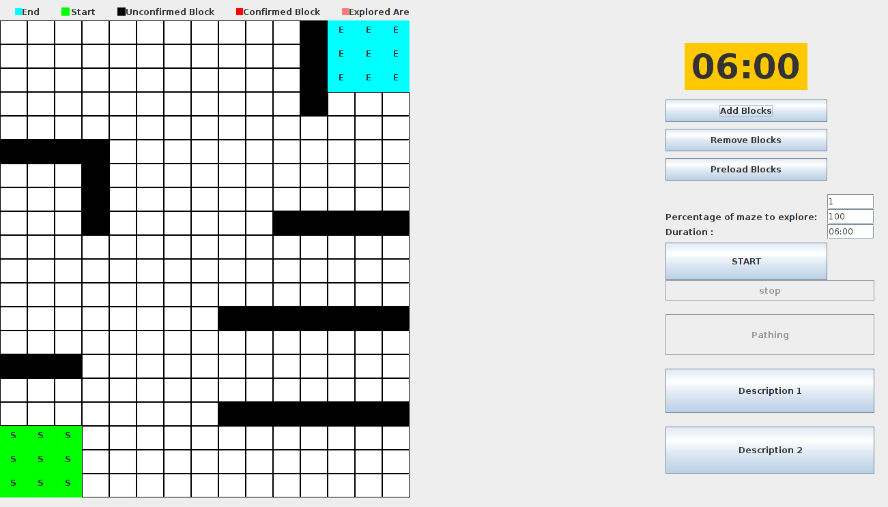
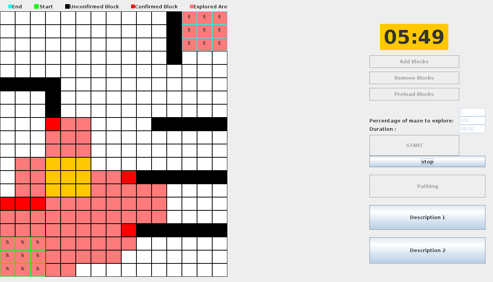
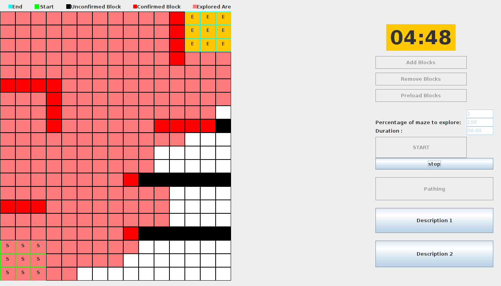
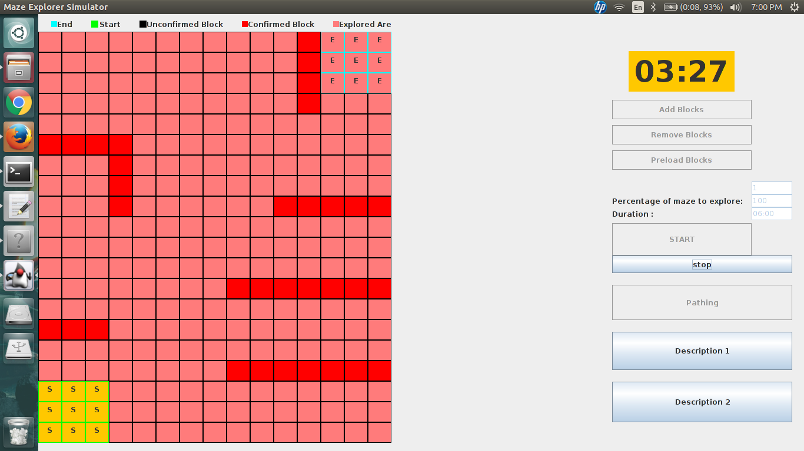
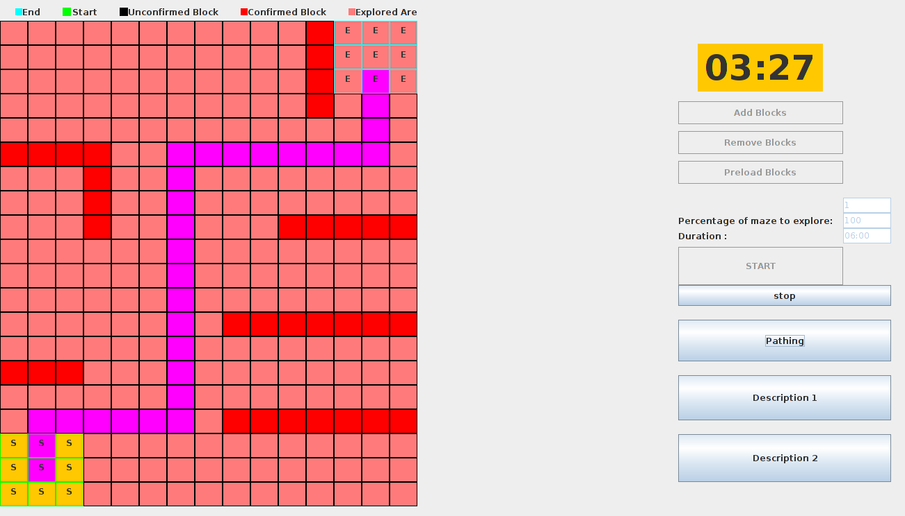

# MDP-Algorithm
<i>Disclaimer - This repository was submitted as part of the CZ3004 - Multidisciplinary Project course at Nanyang Technological University and is no longer maintained.</i>

This repository contains code to achieve autonomous exploration of a 2D maze using a robot. Following an exploration phase, the robot is capable of going from a predefined start zone to an end zone in the shortest possible path. The code uses a left wall hugging algorithm to explore the maze and uses the Djikstra's greedy algorithm. The repository contains two branches. The master branch can be used to run the algorithm in a live set up. The simulator branch can be used to run the simulation.

## Screenshots 

#### A sample maze

#### Initial Phase

#### Robot Reached the Goal Zone

#### Exploration Completed

#### Shortest Path

# Setup
1. Download the [Eclipse IDE](https://eclipse.org/ide/)
2. Import this project into Eclipse.

# Running the Code
The code can be run using the Eclipse IDE.

# Contributors
1. [kaiyyyy](https://github.com/kaiyyyy)
2. [luyaman](https://github.com/luyaman)
